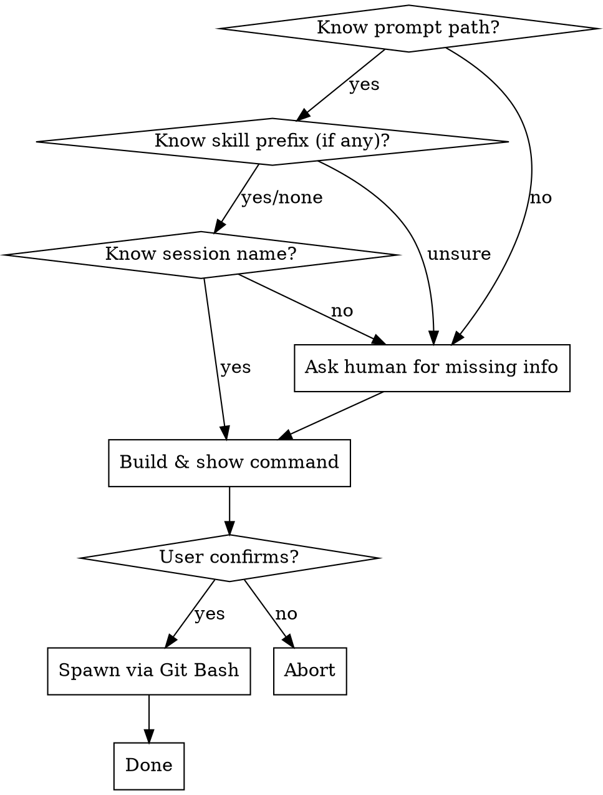

# bg-it — Spawn a Background Claude Session

> **Claude Code only.** This skill uses `claude --bg`. Not available in Codex, Gemini CLI, or other environments — if running outside Claude Code, tell the user and stop.

Spawns a named background `claude` session for **any prompt** — all archetypes supported, including subagent-driven-development, interactive, inline, and custom.

## Flow



## What to collect (ask if unknown)

| Info | How to find it | Ask if... |
|---|---|---|
| **Prompt path** | Recently written `.md` file in `prompts/`, or mentioned in conversation | Not obvious from context |
| **Skill prefix** | `archetype:` field in prompt frontmatter. Omit entirely if prompt is plain (no skill) | No frontmatter and unclear |
| **Session name** | Format: `<folder-name> \| Agent \| <task-name>` | Task name or project root unknown |

**Ask all unknowns in one message — never one at a time.**

## Skill prefix → slash command mapping

| Archetype | Skill prefix |
|---|---|
| `babysitter:yolo` | `babysitter:yolo` |
| `babysitter` (with breakpoints) | `babysitter` |
| `superpowers:executing-plans` | `superpowers:executing-plans` |
| `superpowers:subagent-driven-development` | `superpowers:subagent-driven-development` |
| `superpowers:brainstorming` | `superpowers:brainstorming` |
| plain prompt (no skill) | omit `/<skill-prefix>` — pass only the path |
| custom / interactive | ask human what slash command to use |

**All archetypes are valid** — including subagent-driven-development, interactive sessions, and prompts with no skill prefix at all.

## The commands

**With a skill:**
```bash
(cd "<project-root>" && claude --dangerously-skip-permissions --bg \
  --name "<session-name>" \
  "/<skill-prefix> <abs-prompt-path>" &>/dev/null &)
```

**Plain prompt (no skill prefix):**
```bash
(cd "<project-root>" && claude --dangerously-skip-permissions --bg \
  --name "<session-name>" \
  "<abs-prompt-path>" &>/dev/null &)
```

**Git Bash / WSL only** — `&>/dev/null &` is Bash syntax, not native PowerShell. On Windows, run from Git Bash.

## Before spawning

1. Show the exact command to the user
2. `📄 Prompt: \`<abs-prompt-path>\``
3. `🏷️ Session: \`<session-name>\``
4. **Wait for explicit yes** — "sure", "go", "yes", "do it" all count

## After spawning

- Session runs silently in background
- To check progress: open Claude Agents panel or run `claude --resume`
- If inbox writeback is set up in the prompt: run `/mm update` to sync

## Do NOT spawn if

- Prompt file has `TODO` or `{{...}}` placeholders still in it
- Required skill not installed — check with `ls ~/.claude/skills/` and `ls ~/.claude/plugins/cache/`
- A session for this task is already running
