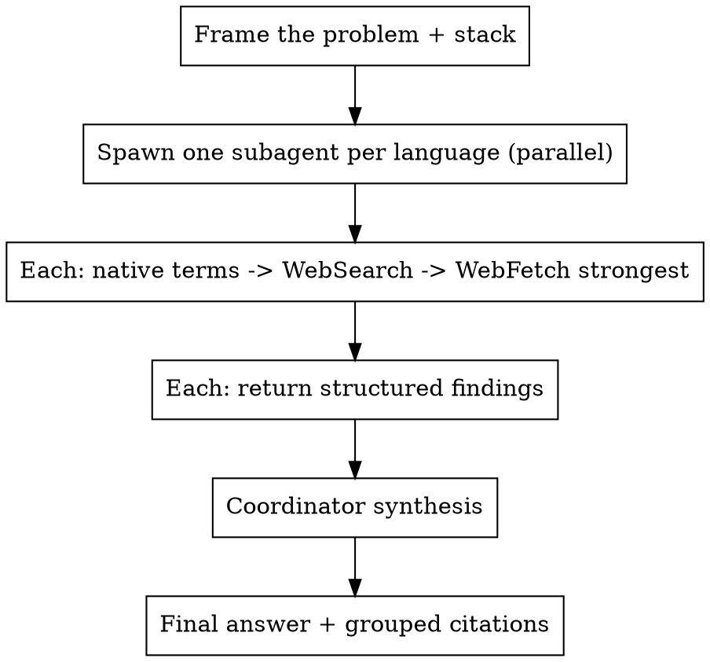

# websearch-multilang — Parallel Multilingual Web Research

> Use this **instead of a plain WebSearch** whenever the goal is to discover ideas, solutions, root causes, workarounds, prior art, or benchmarks. The best fix for a bug or the best idea for a design is often documented only in Chinese, Russian, or Hebrew. English-only search misses it.
>
> **Do NOT use** for a simple "what does this API param do" single-doc lookup — a direct WebSearch/WebFetch is enough there.

## Flow

## Step 1 — Frame

Before spawning, write one short brief the subagents share:
- the problem / idea / question in one paragraph
- the exact stack (language, framework, package names, version numbers, error messages)
- what a good answer looks like (a fix, a list of approaches, a benchmark, etc.)

## Step 2 — Spawn one subagent per language, IN PARALLEL

Launch all of these in a **single message** (multiple Agent tool calls) so they run concurrently. Use the `general-purpose` agent type (it has WebSearch + WebFetch and full tool access for open-web research):

- English Research Subagent
- Chinese Simplified Research Subagent
- Chinese Traditional Research Subagent
- French Research Subagent
- Russian Research Subagent
- Hebrew Research Subagent
- Spanish Research Subagent

Each subagent works **independently in its own language** and must:

1. Translate the problem into **native technical search terms** — not literal translation. Use the real terms a native engineer would type.
2. Build native-language `WebSearch` queries using: correct technical terms, synonyms, exact error messages, package names, framework names, version numbers, common workaround phrases.
3. `WebSearch` first.
4. `WebFetch` the strongest sources.
5. Search official sources, forums, GitHub, blogs, papers, benchmarks, and community discussions — not only official docs, but the professional forums where real-world solutions appear.
6. Return findings in the SAME structured format below — identical schema across all subagents, so the coordinator can compare directly.

### Source priority (all languages)

1. official docs → 2. GitHub Issues/PRs → 3. GitHub Discussions → 4. Stack Overflow → 5. academic papers → 6. benchmark reports → 7. high-quality engineering blogs with reproducible details → 8. official vendor forums → 9. Reddit technical communities → 10. Hacker News → 11. Discord/Slack/community forums if publicly searchable → 12. language-specific developer forums.

### Where each language subagent should look

| Language | Native sources to include |
|---|---|
| **English** | GitHub Issues, GitHub Discussions, Stack Overflow, Reddit, Hacker News, official vendor forums, engineering blogs, project docs, package issue trackers |
| **Chinese Simplified** | CSDN, Zhihu, SegmentFault, Juejin, CNBlogs, Tencent Cloud dev articles, Alibaba Cloud dev articles, Chinese-language GitHub issues, Chinese tech blogs/forums |
| **Chinese Traditional** | iT 邦幫忙, Traditional-Chinese Medium posts, Taiwanese dev blogs, Taiwanese tech forums, Traditional-Chinese GitHub issues, TW vendor/community posts |
| **Russian** | Habr, Stack Overflow на русском, Russian-language GitHub issues, Russian dev blogs, Russian vendor/community forums, publicly indexed Telegram/forum mirrors |
| **French** | Developpez, Stack Overflow en français, French-language GitHub issues, French dev blogs, French vendor/community forums |
| **Hebrew** | Hebrew tech blogs, Israeli dev forums, Hebrew GitHub issues/discussions, Israeli tech community posts (if publicly indexed) |
| **Spanish** | Stack Overflow en español, Spanish-language GitHub issues, Spanish + Latin American dev blogs, Foros del Web, La Web del Programador, Comunidad Platzi, OpenWebinars, Spanish vendor/community forums, Spanish Reddit; Spanish YouTube only if it includes code/links/reproducible steps |

## Step 3 — Each subagent extracts (per finding)

- URL / title
- language
- source type: official docs / GitHub / forum / paper / blog / benchmark / vendor forum
- proposed solution
- evidence quality
- code examples or reproducible steps (if available)
- whether it applies to our exact stack
- date / freshness
- contradictions with other sources
- confidence level

### Forum evaluation (apply when reading forums)

- Is the answer accepted or confirmed by many users?
- Did a maintainer or official representative respond?
- Is there working code?
- Is the solution recent?
- Does the workaround still apply to the current version?
- Are there warnings, edge cases, or reports it breaks something else?

## Step 4 — Coordinator synthesis

After all subagents finish, do ONE synthesis. The coordinator must:

1. Compare findings across languages.
2. Identify repeated solutions that appear **independently in multiple languages** (strong signal).
3. Identify contradictions.
4. Prefer evidence from official docs, maintainers, reproducible GitHub issues, papers, and confirmed forum answers.
5. Downgrade weak forum-only claims unless confirmed elsewhere.
6. Explain which findings are language-specific and which are globally supported.

## Final answer format

- **Best solution**
- **Alternatives**
- **Risks**
- **What to test**
- **Sources grouped by language**
- **Citations grouped by language**
- Clear note where evidence is **strong vs weak**
- **Final confidence level**

## Notes

- Requires `WebSearch` + `WebFetch` (available in Claude Code). If the environment lacks web tools, tell the user and stop.
- Scale languages to the task: the 7 above are the default. Drop or add languages when the domain clearly favors specific ones, but keep at least English + 2 others — cross-language agreement is the whole point.
- Token-heavy by design (7 parallel subagents). Worth it for hard bugs, design ideas, and prior-art hunts; overkill for trivial lookups.
